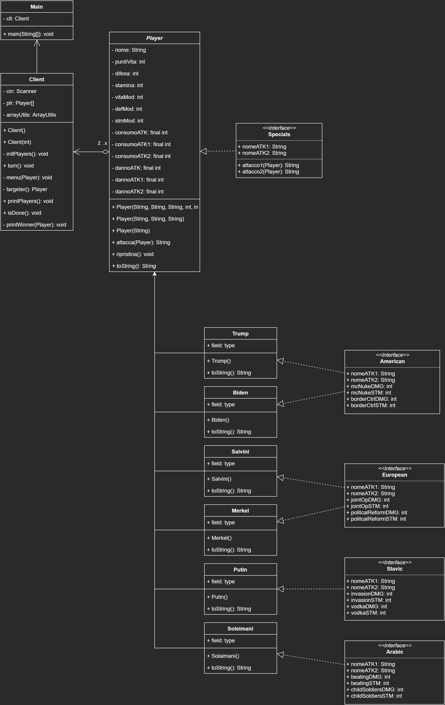

# Verifica_3
Progetto che ricrea un'altro [progetto](https://github.com/chichibio-savoiardi/RPG) vecchio in c++ che mirava a creare un RPG in cui si impersonavano personaggi di risalto

## Analisi Scenario
Conversione da un programma fatto in c++ con paradigma Functional Programming a una in java con paradigma OOP.

## Obiettivi
- [x] Conversione del programma in java
- [x] Completamento della lista di obiettivi nel [PDF](verifica3_progetto.pdf)
- [ ] Dominazione mondiale

# Project UML

